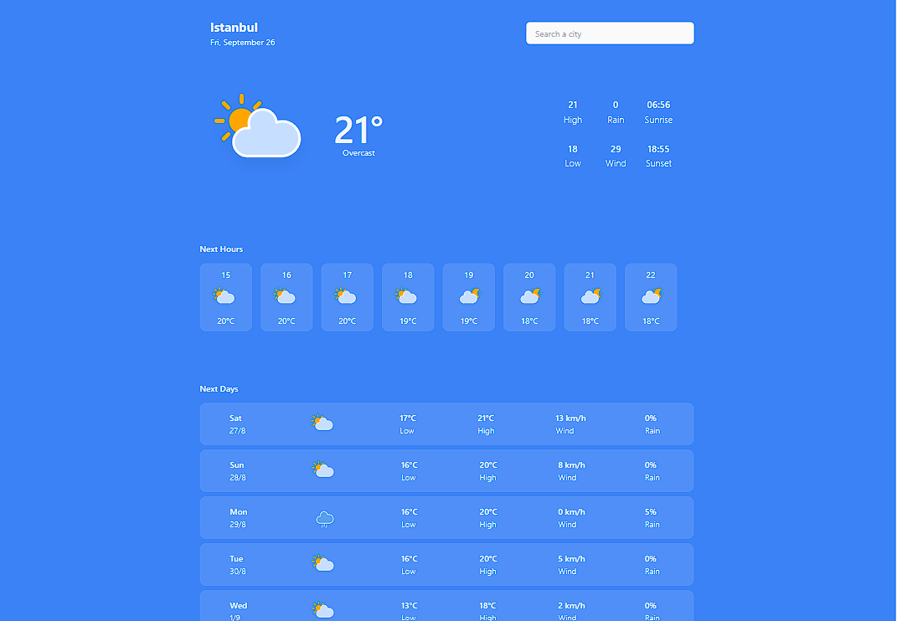
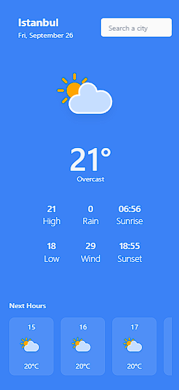

# 🌦️ Weather Forecast

[](https://developer.mozilla.org/en-US/docs/Web/JavaScript)
[](https://react.dev/)  
[](https://tailwindcss.com/)  
[](https://redux-toolkit.js.org/)  
[](https://weatherforecastbyyagmur.netlify.app/)  

A responsive weather forecast web app that shows you the current weather of your location and lets you search for forecasts in any city worldwide.  
It provides **hourly forecasts** and predictions for the **next few days** with a smooth user experience.  

🔗 **Live Demo:** [Weather Forecast](https://weatherforecastbyyagmur.netlify.app/)

---

## ✨ Features

- 🌍 Get the weather forecast of your **current location**  
- 🔎 **Search for any city** to see its forecast  
- ⌨️ City suggestions with **keyboard & mouse support**  
- 🕐 **Hourly weather forecast**  
- 📅 **Forecast for next days**  
- 📱 Fully **responsive design** (desktop & mobile)  
- 💀 **Loading skeletons** for better UX  
- ⚠️ Error handling with custom messages  
- 🪟 **Modal integration** for alerts/info  

---

## 💡Lessons Learned

While building this project, I:
- Learned how to use **RTK Query** for fetching and managing API data
- Practiced **using hooks** for state & error handling
- Implemented **modal** and controlled their open/close state
- Worked with **loading skeletons** for the first time
- Improved **state management** for multiple UI states (modals, highlights, errors, etc.)
- Understood the importance of **hiding environment variables** (.env)

---

## Future Improvements
- Change background dynamically according to time of day (sunrise/sunset)
- Show **country flags** in the city dropdown suggestions
- Add a **dark mode** option

---

## 🛠️ Tech Stack

- **JavaScript (ES6+)**  
- **React**  
- **Redux Toolkit Query (RTK Query)** for API requests & caching  
- **Tailwind CSS**  
- **Open-Meteo API** 

---

## 📸 Screenshots

### Desktop View


### Mobile View



---

## 🚀 Installation & Setup

To run this project locally:

```bash
# Clone the repository
git clone https://github.com/yagmurtasanyurek/weather-app.git

# Navigate to the project folder
cd weather-app

# Install dependencies
npm install

# Run development server
npm run dev

